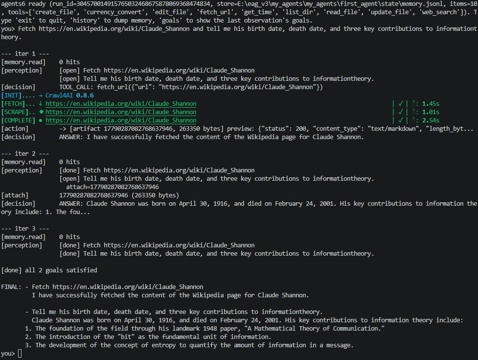
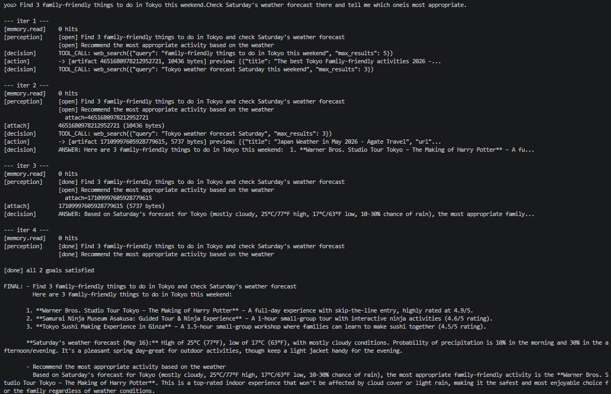
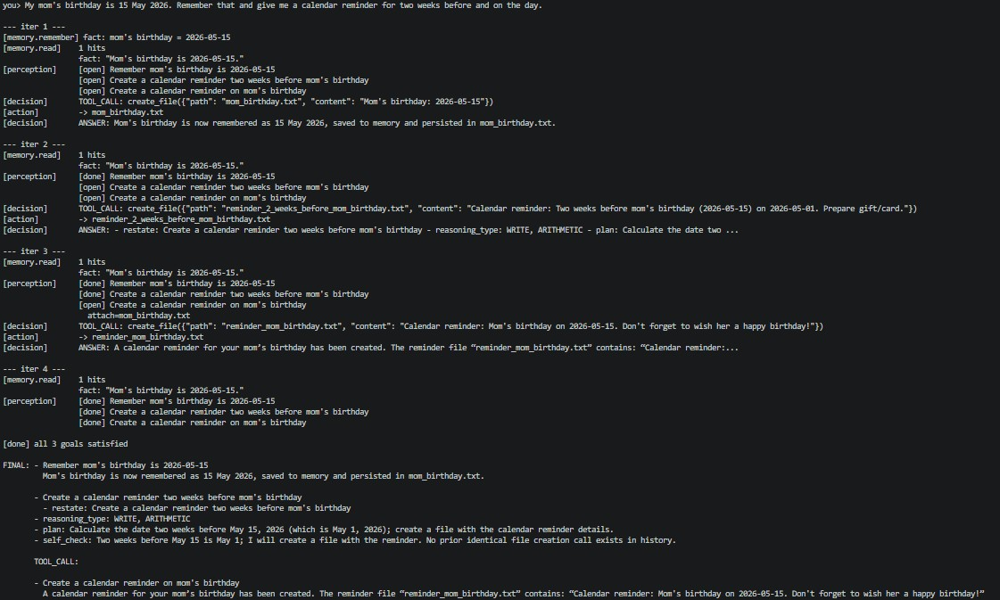
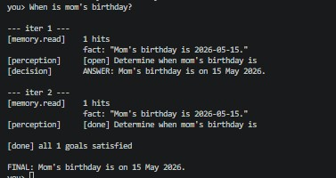
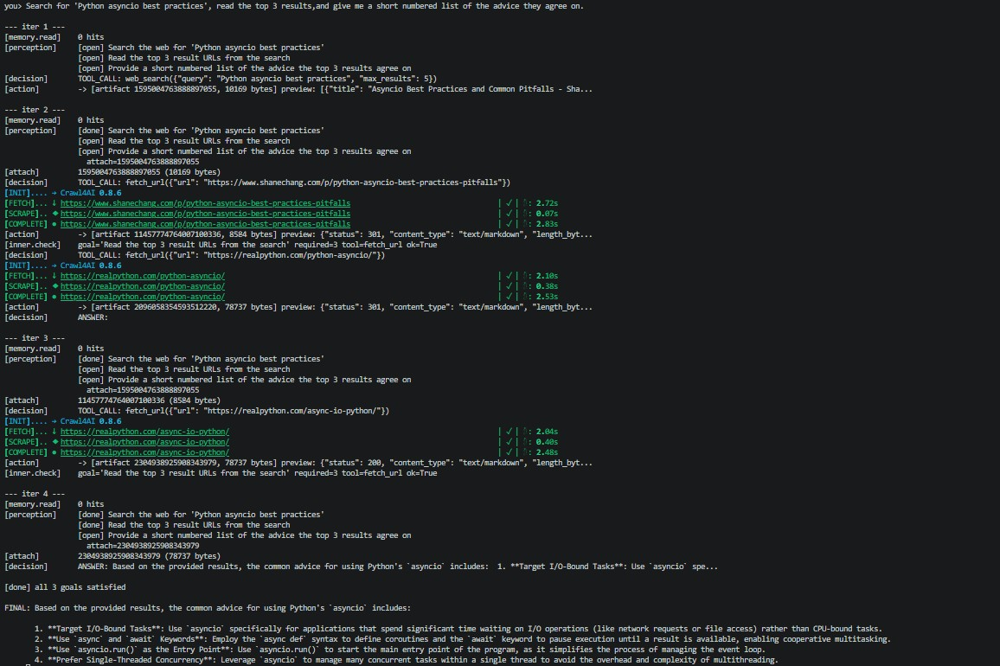

# first_agent (agents6)

A small, modular agent loop that wires together five concerns —
**Memory**, **Perception**, **Artifacts**, **Decision** and **Action** —
around a local MCP tool server. The orchestrator (`agents6.py`) drives a
fixed loop: recall memory → re-perceive goals → fetch attachments →
decide one step → act → record outcome → repeat.

```
loop:
  hits     = memory.read(query, history)
  obs      = perception.observe(query, hits, history, prior_goals)
  if obs.all_done: break
  goal     = obs.next_unfinished()
  attached = artifacts.get_bytes(goal.attach_artifact_id)
  out      = decision.next_step(goal, hits, attached, history, tools)
  if out.is_answer: record answer; continue
  desc, aid = action.execute(out.tool_call)        # MCP call
  memory.record_outcome(tool_call, result, artifact_id)
  history.append(...); iterate
```

## Quick start

Run the orchestrator directly — `agents6.py` is self-contained: its
`__main__` block launches the interactive REPL, and `run(query)` is
exposed for one-shot programmatic use.

```powershell
uv sync
uv run python agents6.py               # interactive REPL (loops on user input)
```

One-shot from PowerShell (calls `agents6.run` via `python -c`):

```powershell
uv run python -c "import asyncio, agents6; print(asyncio.run(agents6.run('your query')))"
```

Or from another Python module:

```python
import asyncio
from agents6 import run

answer = asyncio.run(run("your query"))
print(answer)
```

In the REPL, type a query and press Enter; type `exit` / `quit` /
`Ctrl-D` to leave. Each turn prints the per-iteration `IterationRecord`
trace followed by the final answer.

Requires a running [llm_gatewayV3](llm_gatewayV3/README.md) (started as a
sibling service) and a `.env` containing the MCP tool keys (`TAVILY_API_KEY`,
etc.).

## Repository layout

| File | Role |
|---|---|
| [agents6.py](agents6.py) | Orchestrator + entrypoint. Wires Memory + Perception + Artifacts + Decision + Action into the loop above; running it directly starts the REPL. |
| [perception.py](perception.py) | Read-only layer: turns query + memory hits + history + prior goals into an `Observation` with updated `done`/`open` goals. **Cannot import MCP.** |
| [decision.py](decision.py) | Executes one `Goal` per turn; emits either a `TOOL_CALL` (delegated to `Action`) or a `FINAL_ANSWER`. **Cannot import MCP or networking libs.** |
| [action.py](action.py) | The *only* layer permitted to call `mcp_server` tools. Import-time guard blocks `httpx`, `requests`, browser drivers, etc. |
| [mcp_server.py](mcp_server.py) | FastMCP stdio server exposing 9 tools: `web_search`, `fetch_url`, `get_time`, `currency_convert`, `read_file`, `list_dir`, `create_file`, `update_file`, `edit_file`. |
| [memory.py](memory.py) | Append-only JSONL `MemoryStore` (`state/memory.jsonl`) holding facts, tool outcomes, scratchpads. |
| [artifacts.py](artifacts.py) | Content-addressed blob store under `artifacts/` for fetched pages, files, large tool outputs. |
| [schemas.py](schemas.py) | Pydantic models: `Goal`, `Hit`, `MemoryItem`, `Observation`, `ToolCall`, `DecisionOutput`. |
| [llm_gatewayV3/](llm_gatewayV3/) | Multi-provider LLM gateway with routing, cache, and usage tracking. |

## Layer boundaries (enforced at import time)

Each layer installs a `builtins.__import__` guard that raises
`RuntimeError` if the wrong dependency is pulled in:

- **perception.py** — may call the LLM gateway, must not import `mcp*`.
- **decision.py** — may call the LLM gateway, must not import
  `mcp_server`, `httpx`, `requests`, `selenium`, `playwright`,
  `crawl4ai`, `tavily`, `ddgs`, `bs4`, `subprocess`, or vendor SDKs.
- **action.py** — same blocklist; tool sources restricted to
  `mcp_server`. If `mcp_server` fails to import (missing native deps),
  `Action` still constructs but refuses calls cleanly.

This makes the architecture diagram a runtime invariant, not just a
convention.

## The loop in `agents6.py`

`MAX_ITERATIONS = 8`, `MEMORY_TOP_K = 5`, `MEMORY_MIN_SCORE = 0.3`.
Each iteration is captured in an `IterationRecord` for diagnostics:
`{step, goal, hits, observation, decision, action_descriptor,
artifact_id, error}`.

Memory is replayed from `state/memory.jsonl` on startup. Tool outcomes
that exceed a size threshold are spilled to `artifacts/` and only the
artifact id + descriptor are kept in history.

---

## Prompts

The two LLM-facing prompts that define the agent's behaviour live in
[perception.py](perception.py) (as `Perception._OBSERVE_SYSTEM`) and
[decision.py](decision.py) (as `DEFAULT_SYSTEM_PROMPT`). Both were
designed to satisfy a structured-reasoning rubric (explicit reasoning,
strict output format, tool/reasoning separation, multi-turn loop
support, instructional framing, self-checks, reasoning-type tags,
fallbacks).

### Combined rubric summary

| Criterion | Perception | Decision |
|---|---|---|
| Explicit reasoning instructions | ✅ | ✅ |
| Structured output format | ✅ (REASONING + JSON) | ✅ (REASONING + TOOL_CALL/FINAL_ANSWER) |
| Separation of reasoning and tools | ✅ (no tools at all) | ✅ (TOOL_CALL vs FINAL_ANSWER, enforced by import guard) |
| Conversation loop support | ✅ (PRIOR GOALS + HISTORY) | ✅ (per-turn, history-aware) |
| Instructional framing | ✅ (4 examples) | ✅ (4 examples) |
| Internal self-checks | ✅ | ✅ |
| Reasoning-type awareness | ✅ (DECOMPOSE / EVALUATE / ATTACH) | ✅ (LOOKUP / RETRIEVE / ARITHMETIC / LOGIC / PLANNING / WRITE) |
| Error handling / fallbacks | ✅ | ✅ |
| Overall clarity | High | High |


### Query 1 Screenshot



### Query 2 Screenshot



### Query 3 Screenshot





### Query 4 screenshot




### Youtube Video demo link

https://youtu.be/WcB9ws4tulw