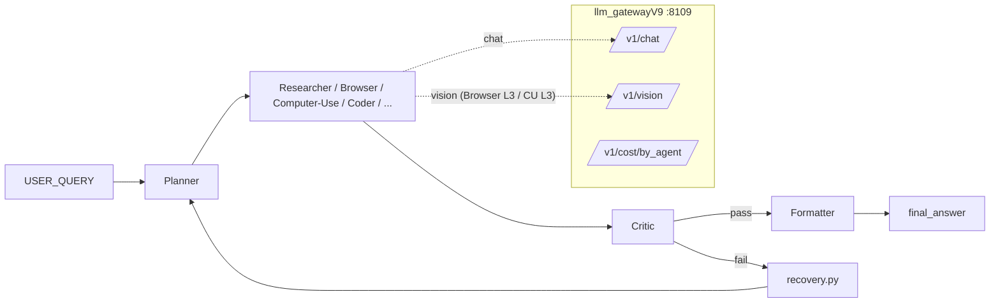

# first_computer_agent (EAG v3 — Session 10)

A growing-graph agent that can browse the web, run code in a sandbox, and
**drive the host operating system** through a five-layer cascade
(`api → hotkeys → uia → electron → vision`). It bundles a planner,
critic, recovery, persistence, FAISS-backed memory, an MCP tool surface,
a local LLM gateway with per-agent cost accounting, and a small
FastAPI dashboard for watching runs in real time.

This package is **Session 10** of the EAG v3 curriculum — it builds on
the Session 8 orchestrator (`flow.py`) and the Session 9 Browser skill
by adding a new **Computer-Use** skill that controls the desktop.

---

## Table of contents

1. [What this is](#what-this-is)
2. [Repository layout](#repository-layout)
3. [Architecture at a glance](#architecture-at-a-glance)
4. [The growing-graph runtime](#the-growing-graph-runtime)
5. [Skill catalogue](#skill-catalogue)
6. [The Computer-Use cascade](#the-computer-use-cascade)
7. [Bundled tasks](#bundled-tasks)
8. [LLM gateway (V9)](#llm-gateway-v9)
9. [Memory, artifacts, persistence](#memory-artifacts-persistence)
10. [Recovery, critic, replay](#recovery-critic-replay)
11. [Dashboard](#dashboard)
12. [Setup](#setup)
13. [Running the agent](#running-the-agent)
14. [Trajectories — the evidence layout](#trajectories--the-evidence-layout)
15. [Tests](#tests)
16. [Troubleshooting](#troubleshooting)
17. [Key files (cheat sheet)](#key-files-cheat-sheet)

---

## What this is

The agent takes a natural-language `USER_QUERY`, asks a Planner skill to
decompose it into a small DAG of further skills, and then executes the
DAG one node at a time. The graph **grows at runtime** from five
sources:

1. The Planner's seed plan.
2. Dynamic successors that any skill emits in `AgentResult.successors`.
3. Static `internal_successors` declared in [agent_config.yaml](agent_config.yaml)
   (e.g. `coder → sandbox_executor`).
4. Critic auto-insertion on every outgoing edge of a `critic: true` skill.
5. Planner re-invocation on node failure, gated by [recovery.py](recovery.py).

A node is `pending → running → complete | failed | skipped`. The
orchestrator never speaks to the LLM directly; it asks
[skills.py](skills.py) to render the prompt, dispatches through
[gateway.py](gateway.py) to the local **llm_gatewayV9** server, and
records the result in [persistence.py](persistence.py).

The Computer-Use skill is the centrepiece of Session 10. It does not go
through the standard chat channel — it owns its own five-layer cascade
in [computer_use/skill.py](computer_use/skill.py) and posts to the
gateway's `/v1/vision` endpoint only when Layer 3 fires.

---

## Repository layout

```
first_computer_agent/
├── flow.py                    # the growing-graph orchestrator
├── skills.py                  # skill registry + dispatcher
├── agent_config.yaml          # skill catalogue (prompts, tools, temps)
├── schemas.py                 # Pydantic contracts shared by every skill
├── perception.py              # USER_QUERY → goals
├── decision.py                # next-step picker
├── action.py                  # tool invocation helpers
├── memory.py                  # FAISS-backed semantic memory
├── vector_index.py            # FAISS wrapper
├── artifacts.py               # binary artifact store
├── persistence.py             # per-session SQLite-style state
├── recovery.py                # failure classifier + Planner re-invocation
├── sandbox.py                 # Python sandbox for the Coder skill
├── gateway.py                 # bridge to llm_gatewayV9 (auto-starts it)
├── mcp_server.py              # MCP tool surface (search_knowledge, …)
├── mcp_runner.py              # MCP client glue
├── replay.py                  # walk a saved session node-by-node
├── dashboard.py               # FastAPI live-run UI on :8200
├── run_computer_use_tasks.py  # evidence runner for the bundled tasks
├── pyproject.toml             # uv / PEP-621 project metadata
├── requirements.txt           # legacy pip pin file (kept in sync)
├── VALIDATION.md              # Session-9 sign-off + cost ledger
├── readme_demo.txt            # produced by the vscode_create_file task
│
├── prompts/                   # one .md prompt per skill
│   ├── planner.md   distiller.md  formatter.md  coder.md
│   ├── critic.md    summariser.md retriever.md  researcher.md
│   ├── browser.md   computer_use.md  sandbox_executor.md
│
├── computer_use/              # Session-10 sub-package
│   ├── skill.py               # cascade orchestrator
│   ├── schemas.py             # ComputerUseOutput, LayerOutcome
│   ├── task_spec.py           # TaskSpec dataclass
│   ├── recorder.py            # per-task trajectory writer
│   ├── host.py                # cua.Localhost wrappers
│   ├── README.md              # deep-dive on the cascade
│   ├── layers/
│   │   ├── layer1_api.py
│   │   ├── layer2a_hotkeys.py
│   │   ├── layer2b_uia.py
│   │   ├── layer2c_electron.py
│   │   └── layer3_vision.py
│   └── tasks/
│       ├── calculator.py            # Layer 2a, zero vision
│       ├── vscode_editor.py         # Layer 2c (CDP)
│       ├── canvas_sketch.py         # Layer 3 (forced vision)
│       ├── vscode_create_file.py    # Layer 2a, real-world workflow
│       └── browser_game.py          # Layer 1 (headless) or Layer 3
│
├── llm_gatewayV9/             # local LLM gateway (FastAPI on :8109)
│   ├── main.py  router.py  providers.py  client.py
│   ├── pricing.py   cache.py   db.py     embedders.py
│   ├── agent_routing.yaml     # per-agent provider pins + fall-throughs
│   └── static/dashboard.html  # gateway's own ledger UI
│
├── dashboard/static/index.html     # Computer-Use live-run UI
│
├── sandbox/papers/            # KB seed for the Retriever skill
├── tests/                     # pytest suite
├── state/                     # runtime artifacts (git-ignored)
│   ├── memory.json
│   ├── artifacts/
│   ├── sessions/<sid>/        # per-run prompt/response/result records
│   ├── trajectories/<sid>/    # per Computer-Use task: events.jsonl, meta.json, frames/
│   └── dashboard/             # session index + <sid>.log (captured flow.py stdout)
└── usage.json                 # gateway-side cumulative usage ledger
```

---

## Architecture at a glance



Every skill node:

1. Has its inputs resolved (`n:<id>`, `art:<id>`, `USER_QUERY`,
   literals) by [skills.py](skills.py).
2. Renders its prompt template from [prompts/](prompts).
3. Sends the prompt through [gateway.py](gateway.py) tagged with
   `agent=<skill_name>` so the gateway ledger attributes cost
   per-skill.
4. Returns a typed `AgentResult` whose `successors` may extend the
   graph.

---

## The growing-graph runtime

[flow.py](flow.py) wraps a `networkx.DiGraph`:

- Nodes: `n:<i>`, with `skill`, `inputs`, `metadata`, `status`.
- Edges: created from each node's `inputs` and from any extension
  pass.
- `MAX_NODES = 60` — a hard cap so a Planner loop cannot grow the
  graph forever.
- `Graph.extend_from()` runs in two passes so a Planner emitting
  `inputs=["n:browse"]` (a label) can refer to a sibling created in
  the same batch — labels are resolved to integer ids before the
  edges are created.

Status transitions:

```
pending ──run──▶ running ──ok──▶ complete
                             └──fail──▶ failed
critic-fail (on parent)        ──▶ skipped (subtree pruned)
```

Recovery is triggered on `failed`. [recovery.py](recovery.py) classifies
the failure (`upstream_failure`, `gateway_blocked`, `tool_error`,
`schema_error`, …) and decides whether to (a) re-queue the same skill
with a hint, or (b) call the Planner again with the failed node and a
short failure report and splice the new sub-DAG in place of the failed
subtree.

---

## Skill catalogue

Skills are declared in [agent_config.yaml](agent_config.yaml). There is
**no Python class per skill** — the catalogue entry plus a markdown
prompt under [prompts/](prompts) is the whole definition. Three
exceptions own their own dispatch path: `sandbox_executor`, `browser`,
`computer_use`.

| skill              | purpose                                                                                   | tools / channel                       |
|--------------------|-------------------------------------------------------------------------------------------|---------------------------------------|
| `planner`          | Decompose `USER_QUERY` into the seed DAG; synthesize recovery sub-DAGs on failure.        | chat                                  |
| `retriever`        | Search Memory + FAISS + MCP `search_knowledge` for material relevant to the query.        | chat + `search_knowledge`             |
| `researcher`       | Multi-step web research producing normalised text outputs.                                | chat + `web_search` + `fetch_url`     |
| `distiller`        | Extract structured fields from raw text (`critic: true`).                                 | chat                                  |
| `summariser`       | Condense long content.                                                                    | chat                                  |
| `critic`           | Pass / fail an upstream node's output (deterministic, temp 0).                            | chat                                  |
| `formatter`        | Render the final answer; the value of `output.final_answer` is what the runtime returns.  | chat                                  |
| `coder`            | Emit Python; static `internal_successors: [sandbox_executor]`.                            | chat                                  |
| `sandbox_executor` | Run the Coder's code; return stdout, stderr, exit code, files.                            | [sandbox.py](sandbox.py) (no LLM)     |
| `browser`          | Four-layer cascade `extract → deterministic → a11y → vision`.                             | own dispatcher; LLM only on layers 3,4 |
| `computer_use`     | Five-layer OS cascade `api → hotkeys → uia → electron → vision`.                          | own dispatcher; LLM only on layer 3   |

Per-skill defaults the orchestrator reads from the yaml: `temperature`,
`max_tokens`, `tools_allowed`, `internal_successors`, `critic`,
`provider_pin`. Anything inside `metadata:` is opaque to the
orchestrator and interpreted by the skill itself (this is how the
Planner addresses Browser and Computer-Use).

---

## The Computer-Use cascade

Five layers, single source of truth in
[computer_use/skill.py](computer_use/skill.py):

```python
CASCADE_ORDER = ["api", "hotkeys", "uia", "electron", "vision"]
```

| Layer | Name        | Underlying tool                                                | LLM? |
|------:|-------------|----------------------------------------------------------------|------|
|     1 | `api`       | `host.shell.run` / `host.clipboard.*` / task's `api_handler`   | no   |
|    2a | `hotkeys`   | `host.keyboard.keypress` / `host.keyboard.type` / `host.shell` | no   |
|    2b | `uia`       | `uiautomation` (cua has no Windows a11y tree)                  | no   |
|    2c | `electron`  | Playwright `connect_over_cdp`                                  | no   |
|     3 | `vision`    | `host.screen.screenshot` + `/v1/vision`                        | yes  |

**Cascade rule (identical to Browser's):**

```text
async with cua.Localhost.connect() as host:
    for layer in CASCADE_ORDER:
        outcome = await layer.try_(task, host, recorder)
        if not outcome.applicable:   continue   # silent skip, no cost
        record outcome
        if outcome.success:          break      # short-circuit
```

`LayerOutcome.applicable=False` means **"recognised the goal but I
can't help"** — silent skip, no failure counted. `success=False` means
**"I tried and didn't satisfy the goal"** — recorded as
`cascade_escalate`, the orchestrator moves on.

Layer 3 enforces a **scan → act → verify** loop with one action per
turn (`click | type | press | finish`). When `task.verify_goal` is set
the layer re-screenshots after each non-finish action and asks the VLM
whether the post-condition holds; `task.max_verify_failures`
consecutive `verify=false` verdicts abort Layer 3 so the cascade can
escalate instead of burning the full turn budget on a stuck state.

The `host` is a single `cua.Localhost` connection opened by the
orchestrator and shared across layers. No layer imports `pyautogui` /
`mss` / `subprocess` directly; the only OS lib pulled in besides cua
is `uiautomation` (Layer 2b, conditional on `sys_platform == 'win32'`).

---

## Bundled tasks

Each task is a `TaskSpec` (see [computer_use/task_spec.py](computer_use/task_spec.py))
exported by `build()` in `computer_use/tasks/<name>.py`. The Planner
addresses one with:

```json
{
  "skill": "computer_use",
  "metadata": {"task_module": "computer_use.tasks.calculator"}
}
```

| Task module                              | Lands at  | Purpose                                                                                       |
|------------------------------------------|-----------|-----------------------------------------------------------------------------------------------|
| `computer_use.tasks.calculator`          | Layer 2a  | Launch `calc.exe`, type `12345+67890=`, `Ctrl+C`, read clipboard. Zero vision calls.          |
| `computer_use.tasks.vscode_editor`       | Layer 2c  | Attach to VS Code over CDP, enumerate open editor tabs via `page.evaluate`.                   |
| `computer_use.tasks.canvas_sketch`       | Layer 3   | Plot ink dots in MS Paint to draw "A I"; validator counts non-white pixels on the canvas.     |
| `computer_use.tasks.vscode_create_file`  | Layer 2a  | Open VS Code, type `readme_demo.txt`, save with `Ctrl+S`, close with `Alt+F4`.                |
| `computer_use.tasks.browser_game`        | Layer 1 / Layer 3 | Vision-only mini-game; headless mode plays via Playwright + `/v1/vision`, visible mode falls through to Layer 3. |

Constraints satisfied (per the assignment):

- ✅ At least one task uses vision — `canvas_sketch`.
- ✅ At least one task uses the Electron CDP path — `vscode_editor`.
- ✅ At least one task completes with zero vision calls — `calculator`.

---

## LLM gateway (V9)

Sibling project under [llm_gatewayV9/](llm_gatewayV9). FastAPI service
that auto-starts on **`http://localhost:8109`** when
[gateway.py](gateway.py) detects it isn't already up.

Endpoints used by this agent:

- `POST /v1/chat` — standard chat completion, `agent=<skill>` tag for
  per-skill cost attribution.
- `POST /v1/chat/batch` — batched chat (Researcher).
- `POST /v1/vision` — single-image vision endpoint, strict-JSON
  responses; only Browser Layer 4 and Computer-Use Layer 3 hit it.
- `POST /v1/embed` — embeddings written by [memory.py](memory.py).
- `GET  /v1/cost/by_agent?session=<sid>` — per-skill ledger
  (calls / in / out tokens / dollars).
- `GET  /v1/routers` — used as the health probe by `ensure_gateway()`.

Routing decisions live in
[llm_gatewayV9/agent_routing.yaml](llm_gatewayV9/agent_routing.yaml);
USD pricing in [llm_gatewayV9/pricing.py](llm_gatewayV9/pricing.py).
The gateway has its own dashboard at
[llm_gatewayV9/static/dashboard.html](llm_gatewayV9/static/dashboard.html).

---

## Memory, artifacts, persistence

- **Memory** ([memory.py](memory.py), [vector_index.py](vector_index.py)) —
  Pydantic `MemoryItem` records (`fact`, `preference`, `tool_outcome`,
  `scratchpad`). `fact / preference / tool_outcome` items are embedded
  via the gateway's `/v1/embed` and indexed in FAISS at write time;
  reads are vector-similarity-first, with keyword overlap as the
  fallback. Backed by [state/memory.json](state/memory.json).

- **Artifacts** ([artifacts.py](artifacts.py)) — binary store keyed by
  `art:<hash>`. Bytes never live in `MemoryItem.value`; they live here.
  Surfaced in `state/artifacts/`.

- **Persistence** ([persistence.py](persistence.py)) — per-session
  store under `state/sessions/<sid>/`. Captures every node's prompt,
  raw model reply, parsed `AgentResult`, retries, elapsed time, and
  provider used. This is what [replay.py](replay.py) walks.

---

## Recovery, critic, replay

**Critic auto-insertion.** Any skill with `critic: true` in the yaml
(today: `distiller`) gets a Critic node spliced onto every outgoing
edge. The Critic's verdict is `pass` or `fail`; on `fail`,
[recovery.py](recovery.py) marks the downstream subtree `skipped` and
asks the Planner to synthesise a recovery sub-DAG.

**Failure classification.** [recovery.py](recovery.py) recognises
several `error_code` values that skills can raise — most importantly
`gateway_blocked` (Browser sees a CAPTCHA / WAF wall),
`upstream_failure`, `tool_error`, `schema_error`. Each maps to a
distinct policy: pure retries for transient errors, Planner
re-invocation for anything semantic.

**Replay.** [replay.py](replay.py) is a stdin-driven walk over a saved
session:

```powershell
uv run python replay.py s8-450f4fb8
```

Keys: `enter` advance, `p` show the rendered prompt, `o` show the full
`AgentResult.output`, `q` quit. Computer-Use trajectories are linked
by `trajectory_dir` in the output, so frames + events are one
directory away.

---

## Dashboard

**Live-run dashboard.** [dashboard.py](dashboard.py) is a tiny FastAPI
app on `http://localhost:8200`:

```powershell
.\.venv\Scripts\python.exe dashboard.py
```

You type a query, the dashboard spawns `flow.py` as a child process,
and the UI polls JSON endpoints (no websockets) every ~700 ms to stream
the orchestrator log and the trajectory frames. UI: [dashboard/static/index.html](dashboard/static/index.html).

**Files the dashboard reads / writes.**

| Path                                                       | Written by                                | Contains                                                                              |
|------------------------------------------------------------|-------------------------------------------|---------------------------------------------------------------------------------------|
| `state/dashboard/sessions.json`                            | [dashboard.py](dashboard.py)              | sid → `{query, started_at, pid, status, exit_code, final_answer, ended_at}` index.    |
| `state/dashboard/<sid>.log`                                | [dashboard.py](dashboard.py) (child stdout)| Captured stdout/stderr of the spawned `flow.py`. Streamed live into the log panel.    |
| `state/trajectories/<sid>/<task>/events.jsonl`             | [computer_use/recorder.py](computer_use/recorder.py) | One JSON object per line: `task_start`, `layer_try`, `action`, `verify`, `cascade_escalate`, `layer_result`, `task_end`. |
| `state/trajectories/<sid>/<task>/meta.json`                | [computer_use/recorder.py](computer_use/recorder.py) | Written by `stop_recording()`: session, task, duration, success, summary.             |
| `state/trajectories/<sid>/<task>/frames/frame_*.png`       | layers 2c / 3                             | Playwright screenshots and full-screen captures fed to the VLM.                        |
| `state/sessions/<sid>/`                                    | [persistence.py](persistence.py)          | Per-node `prompt_sent`, raw reply, parsed `AgentResult`, retries, elapsed, provider.  |
| `usage.json`                                               | [llm_gatewayV9/](llm_gatewayV9)           | Cumulative token + dollar ledger across runs.                                          |

All of the above are git-ignored under `state/` (see [.gitignore](.gitignore)).

---

## Setup

**Prerequisites.**

- Windows 10 / 11 (Layers 2a, 2b, 2c, 3 are Windows-specific; the rest
  is OS-agnostic).
- Python ≥ 3.11.
- [uv](https://docs.astral.sh/uv/) (preferred) or pip.
- A working `llm_gatewayV9/` (this repo ships its own copy under
  [llm_gatewayV9/](llm_gatewayV9)).
- For Layer 2c: VS Code launched once with
  `--remote-debugging-port=9222`.

**Install.**

```powershell
cd e:\eag_v3\my_agents\my_agents\first_computer_agent
uv sync
uv run playwright install chromium
copy .env.example .env
notepad .env   # set TAVILY_API_KEY etc.
```

The dependency surface is pinned in [pyproject.toml](pyproject.toml):

```toml
dependencies = [
  "mcp[cli]", "httpx", "ddgs", "tavily-python", "crawl4ai",
  "python-dotenv", "pydantic>=2.13.4", "faiss-cpu>=1.8.0", "numpy>=1.26",
  "networkx>=3.2", "pyyaml>=6.0",
  # Session 9 — Browser
  "playwright>=1.47", "pillow>=10.0", "trafilatura>=1.12",
  "lxml>=5.2", "lxml-html-clean>=0.1",
  # Session 10 — Computer-Use
  "cua>=0.1.0",
  "uiautomation>=2.0.18 ; sys_platform == 'win32'",
  "fastapi>=0.137.1", "uvicorn>=0.48.0",
]
```

[requirements.txt](requirements.txt) is a thinned-down pip mirror; for
reproducible installs prefer `uv sync` against [pyproject.toml](pyproject.toml).

---

## Running the agent

**End-to-end query.**

```powershell
uv run python flow.py "open Calculator and compute 7*8"
```

`flow.py` will:

1. `ensure_gateway()` — start `llm_gatewayV9` on :8109 if down.
2. Ask the Planner for a seed DAG.
3. Walk the graph, growing it as Planner / Critic / `internal_successors` decide.
4. Print the Formatter's `final_answer` and persist the run to
   `state/sessions/<sid>/`.

**Just the Computer-Use evidence runner** (no Planner, no LLM unless
Layer 3 fires):

```powershell
uv run python run_computer_use_tasks.py
uv run python run_computer_use_tasks.py --only calculator
uv run python run_computer_use_tasks.py --only vscode
uv run python run_computer_use_tasks.py --only canvas
uv run python run_computer_use_tasks.py --session demo01
```

**Live dashboard.**

```powershell
.\.venv\Scripts\python.exe dashboard.py
# open http://localhost:8200
```

⚠️ Tasks 1 and 3 take focus away from the active window (Calculator
hotkeys, Paint screenshot). Don't type during a run.

---

## Trajectories — the evidence layout

Every Computer-Use task gets its own directory under
`state/trajectories/<session>/<task>/`:

```
state/trajectories/cua_20260614_140312/
├── 01_calculator_hotkeys/
│   ├── events.jsonl     # one JSON event per line
│   ├── meta.json        # session, task, duration, success, summary
│   └── frames/          # empty for hotkey tasks
├── 02_vscode_electron_cdp/
│   ├── events.jsonl
│   ├── meta.json
│   └── frames/
│       └── frame_0001.png   # Playwright screenshot
└── 03_canvas_vision/
    ├── events.jsonl
    ├── meta.json
    └── frames/
        ├── frame_0001.png   # full-screen, fed to the VLM
        └── frame_0002.png   # second turn
```

`events.jsonl` rows include `task_start`, `layer_try`, `action`,
`verify`, `cascade_escalate`, `layer_result`, `task_end`. Replay
colour-codes events by the layer that emitted them.

---

## Tests

```powershell
uv run pytest -q
uv run pytest -q tests/test_recovery.py
uv run pytest -q tests/test_natural_vision_search.py
```

Notable tests:

- [tests/test_recovery.py](tests/test_recovery.py) — failure
  classifier + Planner re-invocation.
- [tests/test_recovery_amnesia.py](tests/test_recovery_amnesia.py) —
  recovery does not lose memory across the failed subtree.
- [tests/test_critic_autoinsert.py](tests/test_critic_autoinsert.py) —
  Critic auto-insertion on `critic: true` skills.
- [tests/test_natural_vision_search.py](tests/test_natural_vision_search.py) —
  natural-cascade Layer 3 escalation (no `force_path`).
- [test_mcp_server.py](test_mcp_server.py) — MCP tool surface.

`network` and `embed` markers gate tests that need internet / the
gateway's `/v1/embed` endpoint:

```powershell
uv run pytest -q -m "not network and not embed"
```

---

## Troubleshooting

| Symptom                                                    | Likely cause / fix                                                                                                                                                |
|------------------------------------------------------------|-------------------------------------------------------------------------------------------------------------------------------------------------------------------|
| `Gateway V9 directory not found at ...`                    | Set `GATEWAY_V9_DIR=...` or move `llm_gatewayV9/` next to `flow.py` (see `_resolve_gateway_dir()` in [gateway.py](gateway.py)).                                   |
| `cost-by-agent` is empty for non-Browser skills            | A stale V8 on :8108 may be serving 200s. Confirm V9 is on :8109; see VALIDATION.md §"Rough edges".                                                                |
| Layer 2c marks `applicable=False`                          | VS Code wasn't launched with `--remote-debugging-port=9222`, or `CUA_VSCODE_PORT` doesn't match. Restart VS Code with the flag.                                   |
| Layer 3 says `interaction_failed: bad_json`                | The VLM didn't return strict JSON. The cascade gives up on Layer 3 rather than thrashing — see [computer_use/layers/layer3_vision.py](computer_use/layers/layer3_vision.py).         |
| Calculator task captures empty clipboard                   | Calculator window race; rerun. The Layer 2a capture is the source of truth — the validator deliberately doesn't re-read.                                         |
| Browser run reports `gateway_blocked`                      | Working as intended on CAPTCHA/WAF walls. Recovery should have planned a route-around (Researcher). See [VALIDATION.md](VALIDATION.md) §1.                          |
| `MAX_NODES` reached                                        | Planner loop. Inspect the session in `state/sessions/<sid>/`; the cap in [flow.py](flow.py) is intentional.                                                        |

---

## Key files (cheat sheet)

| Want to…                                            | Read                                                                                  |
|-----------------------------------------------------|---------------------------------------------------------------------------------------|
| Understand the orchestrator loop                    | [flow.py](flow.py)                                                                    |
| Add or tune a skill                                 | [agent_config.yaml](agent_config.yaml) + a `prompts/<skill>.md` file                  |
| Change the dispatcher                               | [skills.py](skills.py)                                                                |
| Trace contracts between layers                      | [schemas.py](schemas.py)                                                              |
| Write a new Computer-Use task                       | [computer_use/task_spec.py](computer_use/task_spec.py) and an example in `computer_use/tasks/` |
| Walk the cascade                                    | [computer_use/skill.py](computer_use/skill.py)                                        |
| Debug a Layer-3 vision turn                         | [computer_use/layers/layer3_vision.py](computer_use/layers/layer3_vision.py)          |
| Replay a saved run                                  | [replay.py](replay.py)                                                                |
| See per-agent cost                                  | `GET http://localhost:8109/v1/cost/by_agent?session=<sid>`                            |
| Watch a run live                                    | [dashboard.py](dashboard.py) → `http://localhost:8200`                                |
| Tail a spawned run's stdout                         | `state/dashboard/<sid>.log`                                                           |
| Inspect a Computer-Use trajectory                   | `state/trajectories/<sid>/<task>/events.jsonl` + `meta.json` + `frames/`              |
| Read the Session-9 sign-off (cost ledger, smokes)   | [VALIDATION.md](VALIDATION.md)                                                        |
| Read the Computer-Use deep-dive                     | [computer_use/README.md](computer_use/README.md)                                      |

---

*Session 10 of EAG v3. Built on Session 8's growing-graph runtime and
Session 9's Browser cascade. The new sub-package is `computer_use/`;
the only orchestrator-side change is the `if skill.name ==
"computer_use":` branch in [skills.py](skills.py) — `flow.py` is
unchanged.*
